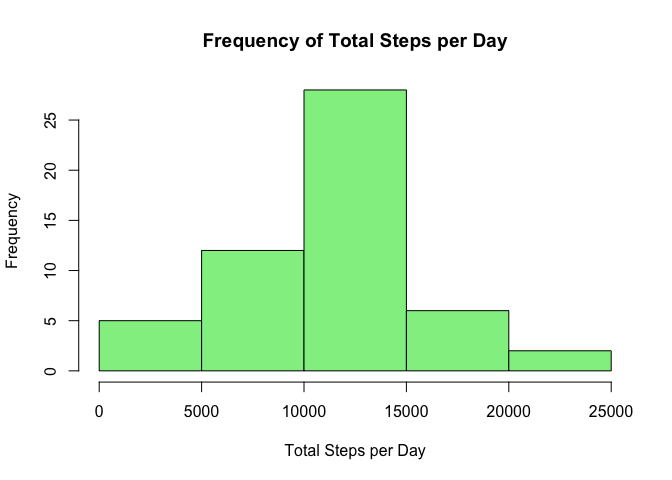
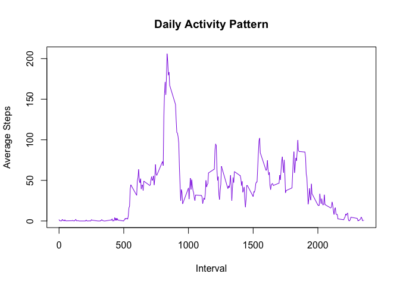
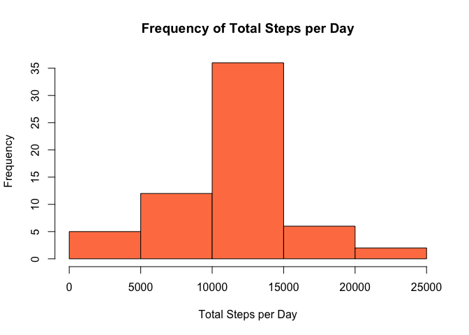
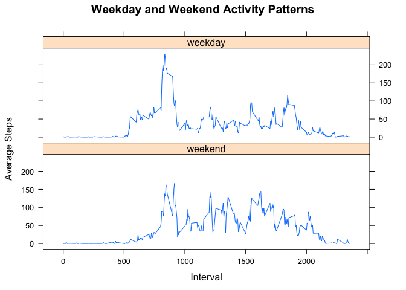

# Reproducible Research: Peer Assessment 1

## Loading and preprocessing the data
This section assumes the current working directory is where you want to work.

These are the steps involved in preprocessing the activity data:  
1. Download the data, if necessary.  
2. Unzip the datafile, if necessary.  
3. Read the CSV. 


```r
if (file.exists('activity.csv') == FALSE) {
      if (file.exists('activity.zip') == FALSE) {
            url <- 'https://d396qusza40orc.cloudfront.net/repdata%2Fdata%2Factivity.zip'
            download.file(url, destfile = 'activity.zip', 
                          method = "curl")
            }
      unzip('activity.zip')
      }
activ = read.csv("activity.csv", na.strings = "NA")
```


## What is mean total number of steps taken per day?
In this section, we calculate the total number of steps per day for each day in the study. Then, we calculate and plot the number of times each total was reached. 

```r
library(dplyr)
library(lattice)
```

```r
grp <- group_by(activ, date)
totstep <- summarize(grp, totalstep = sum(steps), na.rm=TRUE)
hist(totstep$totalstep, c = 'palegreen2', 
     xlab = 'Total Steps per Day', 
     main = 'Frequency of Total Steps per Day')
```

\

```r
meanstp = as.integer(mean(totstep$totalstep, na.rm = TRUE))
medstp = median(totstep$totalstep, na.rm=TRUE)
```
### The mean number of steps taken per day is 10766 and the median is 10765.  

## What is the average daily activity pattern?
In this section we look at the total number of steps for each time of day interval for all days in the study. The, we calculate which interval had the highest number of steps. 

```r
grp2 = group_by(activ, interval)
inttot <- summarize(grp2, avgstep=mean(steps, na.rm=TRUE))
plot(inttot$interval, inttot$avgstep, 
     type = 'l', col = 'blueviolet', 
     main = "Daily Activity Pattern", 
     xlab = "Interval", ylab = "Average Steps")
```

\

```r
maxline <- subset(inttot,
                 avgstep==max(inttot$avgstep))
maxint = maxline$interval
maxstep = as.integer(maxline$avgstep)
```
### The highest average number of steps for any time interval was 206 during the 835 interval.  

## Imputing missing values
In order to fully use the data, the NA values will be imputed to the average step count for that particular time interval. We then look at the same plots as we first created to compare the imuted data to the original data. 


```r
activ2 <- merge(activ, inttot, by.x = "interval", by.y ="interval")
top <- nrow(activ2)
for (i in seq_along(1:top)) {
      if (is.na(activ2[i, 2]) == TRUE) {
            activ2[i, 2] <- activ2[i, 4]
      }
}

grp3 <- group_by(activ2, date)
totstep2 <- summarize(grp3, totalstep = sum(steps), na.rm=TRUE)
hist(totstep2$totalstep, c = 'coral', 
     xlab = 'Total Steps per Day', 
     main = 'Frequency of Total Steps per Day')
```

\

```r
meanstp2 = as.integer(mean(totstep2$totalstep, na.rm = TRUE))
medstp2 = as.integer(median(totstep2$totalstep, na.rm=TRUE))
```
### The new mean number of steps taken per day is 10766 and the new median is 10766. The mean did not change, but the median went up by one step. Imputing the NA values had little to no effect on the data. 

## Are there differences in activity patterns between weekdays and weekends?
First, we create a factor variable describing whether a particular record occured on a weekend or a weekday. Then we build a plot for both weekends and weekdays.  


```r
weekdays1 <- c('Monday', 'Tuesday', 'Wednesday', 'Thursday', 'Friday')
activ2$Ddate <- as.Date(activ2$date, format = '%Y-%m-%d')
activ2$wDay <- factor((weekdays(activ2$Ddate) %in% weekdays1),
                      levels=c(FALSE, TRUE), 
                      labels=c('weekend', 'weekday'))

grp4 <- group_by(activ2, interval, wDay)
inttot2 <- summarize(grp4, avgstep=mean(steps))
xyplot(inttot2$avgstep ~ inttot2$interval | inttot2$wDay, type ="l", 
       main = "Weekday and Weekend Activity Patterns",
       xlab = "Interval",
       ylab = "Average Steps", 
       layout = c(1,2))
```

\

### On weekends, study participants seem to get up later but walk more throuhout the day. 


